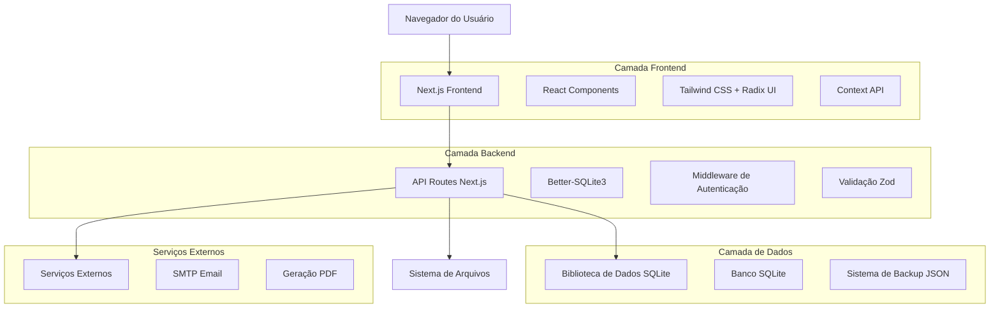
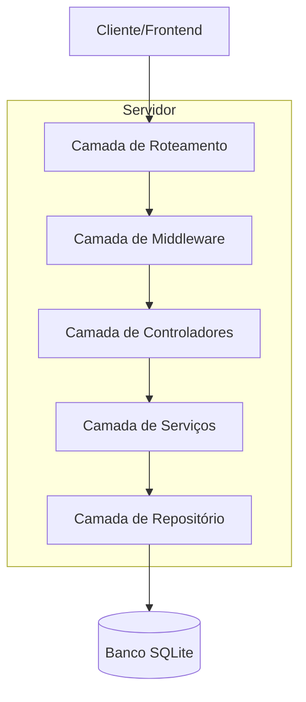
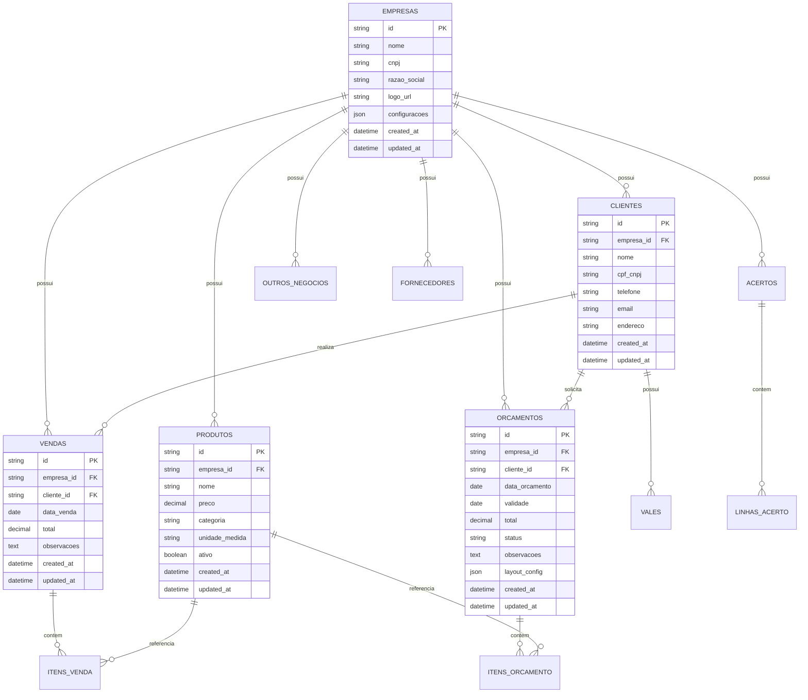

# Documento de Arquitetura Técnica - ERP-BR
## Technical Architecture Document

---

## 1. Arquitetura do Sistema



## 2. Descrição das Tecnologias

- **Frontend**: Next.js@15.5.3 + React@19 + TypeScript@5 + Tailwind CSS@4.1.9
- **Backend**: Next.js API Routes + Better-SQLite3
- **Banco de Dados**: SQLite com Better-SQLite3
- **UI Framework**: Radix UI + Shadcn/ui + Lucide React
- **Validação**: Zod@3.25.67
- **Autenticação**: JWT + bcryptjs
- **Email**: Nodemailer@7.0.6
- **PDF**: jsPDF@3.0.2
- **Containerização**: Docker + Docker Compose

## 3. Definições de Rotas

| Rota | Propósito |
|------|----------|
| / | Página inicial com dashboard principal |
| /login | Página de autenticação do usuário |
| /menu | Menu principal de navegação |
| /clientes | Gestão de clientes |
| /produtos | Catálogo de produtos |
| /vendas | Sistema de vendas |
| /orcamentos | Criação e gestão de orçamentos |
| /relatorios | Dashboard e relatórios |
| /backup | Sistema de backup e restauração |
| /configuracoes | Configurações do sistema |
| /acertos | Sistema financeiro de acertos |
| /vales | Gestão de vales (crédito/débito) |
| /outros-negocios | Receitas e despesas extras |
| /fornecedores | Cadastro de fornecedores |

## 4. Definições de API

### 4.1 APIs Principais

**Autenticação**
```
POST /api/auth/login
```

Request:
| Parâmetro | Tipo | Obrigatório | Descrição |
|-----------|------|-------------|----------|
| email | string | true | Email do usuário |
| password | string | true | Senha do usuário |

Response:
| Parâmetro | Tipo | Descrição |
|-----------|------|----------|
| success | boolean | Status da autenticação |
| token | string | JWT token para sessão |
| user | object | Dados do usuário |

**Gestão de Clientes**
```
GET /api/clientes
POST /api/clientes
PUT /api/clientes/[id]
DELETE /api/clientes/[id]
```

**Gestão de Produtos**
```
GET /api/produtos
POST /api/produtos
PUT /api/produtos/[id]
DELETE /api/produtos/[id]
```

**Sistema de Vendas**
```
GET /api/vendas
POST /api/vendas
PUT /api/vendas/[id]
DELETE /api/vendas/[id]
```

**Sistema de Orçamentos**
```
GET /api/orcamentos
POST /api/orcamentos
PUT /api/orcamentos/[id]
DELETE /api/orcamentos/[id]
POST /api/orcamentos/[id]/email
```

**Sistema de Backup**
```
GET /api/backup/export
POST /api/backup/import
GET /api/backup/status
```

**Relatórios e Dashboard**
```
GET /api/dashboard/metrics
GET /api/relatorios/vendas
GET /api/relatorios/financeiro
```

### 4.2 Tipos TypeScript Compartilhados

```typescript
// Tipos de Cliente
interface Cliente {
  id: string;
  nome: string;
  cpf_cnpj?: string;
  telefone?: string;
  email?: string;
  endereco?: string;
  cidade?: string;
  estado?: string;
  cep?: string;
  created_at: string;
  updated_at: string;
}

// Tipos de Produto
interface Produto {
  id: string;
  nome: string;
  preco: number;
  categoria?: string;
  unidade_medida: string;
  ativo: boolean;
  created_at: string;
  updated_at: string;
}

// Tipos de Venda
interface Venda {
  id: string;
  cliente_id: string;
  data_venda: string;
  total: number;
  observacoes?: string;
  itens: ItemVenda[];
  created_at: string;
  updated_at: string;
}

interface ItemVenda {
  id: string;
  venda_id: string;
  produto_id: string;
  quantidade: number;
  preco_unitario: number;
  subtotal: number;
}

// Tipos de Orçamento
interface Orcamento {
  id: string;
  cliente_id: string;
  data_orcamento: string;
  validade: string;
  total: number;
  status: 'pendente' | 'aprovado' | 'rejeitado';
  observacoes?: string;
  itens: ItemOrcamento[];
  layout_config?: LayoutConfig;
  created_at: string;
  updated_at: string;
}
```

## 5. Arquitetura do Servidor



## 6. Modelo de Dados

### 6.1 Diagrama Entidade-Relacionamento



### 6.2 Linguagem de Definição de Dados (DDL)

**Tabela de Empresas**
```sql
CREATE TABLE empresas (
    id TEXT PRIMARY KEY DEFAULT (lower(hex(randomblob(16)))),
    nome TEXT NOT NULL,
    cnpj TEXT UNIQUE,
    razao_social TEXT,
    logo_url TEXT,
    configuracoes TEXT DEFAULT '{}',
    created_at DATETIME DEFAULT CURRENT_TIMESTAMP,
    updated_at DATETIME DEFAULT CURRENT_TIMESTAMP
);

CREATE INDEX idx_empresas_cnpj ON empresas(cnpj);
```

**Tabela de Clientes**
```sql
CREATE TABLE clientes (
    id TEXT PRIMARY KEY DEFAULT (lower(hex(randomblob(16)))),
    empresa_id TEXT NOT NULL,
    nome TEXT NOT NULL,
    cpf_cnpj TEXT,
    telefone TEXT,
    email TEXT,
    endereco TEXT,
    cidade TEXT,
    estado TEXT,
    cep TEXT,
    created_at DATETIME DEFAULT CURRENT_TIMESTAMP,
    updated_at DATETIME DEFAULT CURRENT_TIMESTAMP,
    FOREIGN KEY (empresa_id) REFERENCES empresas(id)
);

CREATE INDEX idx_clientes_empresa ON clientes(empresa_id);
CREATE INDEX idx_clientes_nome ON clientes(nome);
CREATE INDEX idx_clientes_cpf_cnpj ON clientes(cpf_cnpj);
```

**Tabela de Produtos**
```sql
CREATE TABLE produtos (
    id TEXT PRIMARY KEY DEFAULT (lower(hex(randomblob(16)))),
    empresa_id TEXT NOT NULL,
    nome TEXT NOT NULL,
    preco DECIMAL(10,2) NOT NULL DEFAULT 0,
    categoria TEXT,
    unidade_medida TEXT NOT NULL DEFAULT 'UN',
    ativo BOOLEAN DEFAULT 1,
    created_at DATETIME DEFAULT CURRENT_TIMESTAMP,
    updated_at DATETIME DEFAULT CURRENT_TIMESTAMP,
    FOREIGN KEY (empresa_id) REFERENCES empresas(id)
);

CREATE INDEX idx_produtos_empresa ON produtos(empresa_id);
CREATE INDEX idx_produtos_nome ON produtos(nome);
CREATE INDEX idx_produtos_categoria ON produtos(categoria);
```

**Tabela de Vendas**
```sql
CREATE TABLE vendas (
    id TEXT PRIMARY KEY DEFAULT (lower(hex(randomblob(16)))),
    empresa_id TEXT NOT NULL,
    cliente_id TEXT NOT NULL,
    data_venda DATE NOT NULL,
    total DECIMAL(10,2) NOT NULL DEFAULT 0,
    observacoes TEXT,
    created_at DATETIME DEFAULT CURRENT_TIMESTAMP,
    updated_at DATETIME DEFAULT CURRENT_TIMESTAMP,
    FOREIGN KEY (empresa_id) REFERENCES empresas(id),
    FOREIGN KEY (cliente_id) REFERENCES clientes(id)
);

CREATE INDEX idx_vendas_empresa ON vendas(empresa_id);
CREATE INDEX idx_vendas_cliente ON vendas(cliente_id);
CREATE INDEX idx_vendas_data ON vendas(data_venda DESC);
```

**Tabela de Itens de Venda**
```sql
CREATE TABLE itens_venda (
    id TEXT PRIMARY KEY DEFAULT (lower(hex(randomblob(16)))),
    venda_id TEXT NOT NULL,
    produto_id TEXT NOT NULL,
    quantidade DECIMAL(10,3) NOT NULL,
    preco_unitario DECIMAL(10,2) NOT NULL,
    subtotal DECIMAL(10,2) NOT NULL,
    FOREIGN KEY (venda_id) REFERENCES vendas(id) ON DELETE CASCADE,
    FOREIGN KEY (produto_id) REFERENCES produtos(id)
);

CREATE INDEX idx_itens_venda_venda ON itens_venda(venda_id);
CREATE INDEX idx_itens_venda_produto ON itens_venda(produto_id);
```

**Dados Iniciais**
```sql
-- Inserir empresa padrão
INSERT INTO empresas (id, nome, cnpj, razao_social) 
VALUES ('empresa-padrao', 'Empresa Padrão', '00.000.000/0001-00', 'Empresa Padrão LTDA');

-- Inserir unidades de medida padrão
INSERT INTO unidades_medida (nome, sigla, tipo) VALUES 
('Unidade', 'UN', 'quantidade'),
('Quilograma', 'KG', 'peso'),
('Metro', 'M', 'comprimento'),
('Litro', 'L', 'volume');

-- Inserir modalidades de pagamento padrão
INSERT INTO modalidades (nome, tipo, ativo) VALUES 
('Dinheiro', 'recebimento', 1),
('PIX', 'recebimento', 1),
('Cartão de Débito', 'recebimento', 1),
('Cartão de Crédito', 'recebimento', 1);
```
