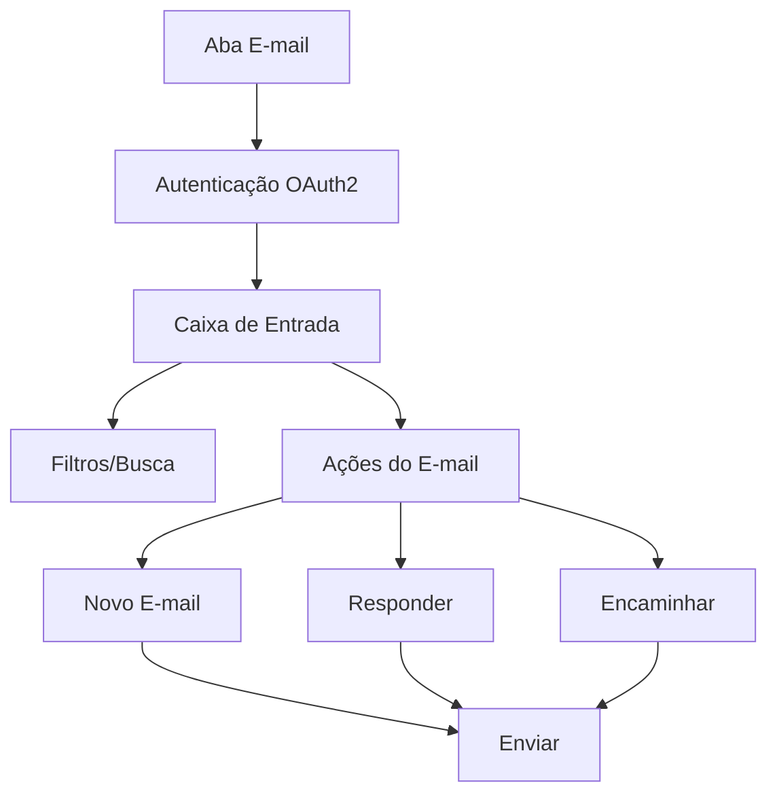

# Documentação Técnica - Aba E-mail com Gmail

## 1. Visão Geral do Produto
Implementação de uma aba completa de E-mail no sistema ERP integrada com Gmail API, permitindo gerenciamento de e-mails diretamente na plataforma com autenticação OAuth2 e funcionalidades completas de caixa de entrada, envio, resposta e encaminhamento.

## 2. Funcionalidades Principais

### 2.1 Papéis de Usuário
| Papel | Método de Registro | Permissões Principais |
|-------|-------------------|----------------------|
| Usuário Padrão | Login existente no sistema | Visualizar e-mails, enviar e-mails básicos |
| Administrador | Acesso administrativo | Configurar credenciais Gmail, gerenciar permissões de e-mail |

### 2.2 Módulos de Funcionalidade
Nossos requisitos de e-mail consistem nas seguintes páginas principais:
1. **Página Principal de E-mail**: caixa de entrada, filtros rápidos, campo de busca
2. **Composição de E-mail**: novo e-mail, resposta, encaminhamento
3. **Configurações de E-mail**: credenciais OAuth2, configurações SMTP/IMAP

### 2.3 Detalhes das Páginas
| Nome da Página | Nome do Módulo | Descrição da Funcionalidade |
|----------------|----------------|-----------------------------|
| Página Principal | Caixa de Entrada | Listar e-mails com colunas: Remetente, Assunto, Data/Hora, Ações. Incluir paginação e ordenação |
| Página Principal | Filtros Rápidos | Filtrar por: Hoje, Últimos 7 dias, Não lidos, Todos |
| Página Principal | Campo de Busca | Buscar e-mails por remetente, assunto ou conteúdo |
| Página Principal | Ações da Lista | Abrir, responder, encaminhar, excluir e-mails |
| Composição | Novo E-mail | Campos: Para, CC, CCO, Assunto, corpo do e-mail, anexos |
| Composição | Editor de Texto | Editor rich text para formatação de e-mails |
| Composição | Gerenciar Anexos | Upload, visualização e remoção de anexos |
| Configurações | OAuth2 Gmail | Configurar credenciais de aplicação Gmail |
| Configurações | Permissões | Controlar acesso de usuários às funcionalidades de e-mail |

## 3. Processo Principal
Fluxo do usuário para gerenciamento de e-mails:
1. Usuário acessa a aba E-mail
2. Sistema autentica com Gmail via OAuth2
3. Usuário visualiza caixa de entrada com e-mails sincronizados
4. Usuário pode filtrar, buscar e realizar ações nos e-mails
5. Para novo e-mail: usuário clica em "Novo", preenche campos e envia
6. Para resposta: usuário seleciona e-mail, clica em "Responder", edita e envia

## 4. Design da Interface do Usuário
### 4.1 Estilo de Design
- Cores primárias: #3B82F6 (azul), #10B981 (verde)
- Cores secundárias: #6B7280 (cinza), #EF4444 (vermelho para exclusão)
- Estilo de botão: Arredondado com sombra sutil
- Fonte: Inter, tamanhos 14px (corpo), 16px (títulos), 12px (metadados)
- Estilo de layout: Baseado em cards com navegação lateral
- Ícones: Lucide React para consistência

### 4.2 Visão Geral do Design das Páginas
| Nome da Página | Nome do Módulo | Elementos da UI |
|----------------|----------------|----------------|
| Página Principal | Caixa de Entrada | Tabela responsiva com hover effects, cores alternadas nas linhas, ícones de status (lido/não lido) |
| Página Principal | Filtros | Botões de filtro com estado ativo/inativo, contador de e-mails |
| Página Principal | Busca | Input com ícone de lupa, sugestões de busca |
| Composição | Editor | Interface similar ao Gmail com toolbar de formatação, preview de anexos |
| Configurações | OAuth2 | Formulário com status de conexão, botão de reconectar |

### 4.3 Responsividade
Design mobile-first com adaptação para desktop, otimização para touch em dispositivos móveis, colapso de sidebar em telas pequenas.
